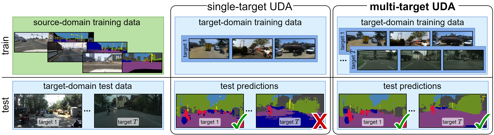

# Multi-Target Adversarial Frameworks for Domain Adaptation in Semantic Segmentation

## Paper


[Multi-Target Adversarial Frameworks for Domain Adaptation in Semantic Segmentation](https://arxiv.org/abs/2108.06962)  
 Antoine Saporta, [Tuan-Hung Vu](https://tuanhungvu.github.io/), [Matthieu Cord](http://webia.lip6.fr/~cord/), [Patrick Pérez](https://ptrckprz.github.io/)  
 valeo.ai, France  
 IEEE International Conference on Computer Vision (ICCV), 2021 (**Poster**)

If you find this code useful for your research, please cite our [paper](https://arxiv.org/abs/2108.06962):

```
@inproceedings{saporta2021mtaf,
  title={Multi-Target Adversarial Frameworks for Domain Adaptation in Semantic Segmentation},
  author={Saporta, Antoine and Vu, Tuan-Hung and Cord, Mathieu and P{\'e}rez, Patrick},
  booktitle={ICCV},
  year={2021}
}
```

## Abstract
In this work, we address the task of unsupervised domain adaptation (UDA) for semantic segmentation in presence of multiple target domains: The objective is to train a single model that can handle all these domains at test time. Such a multi-target adaptation is crucial for a variety of scenarios that real-world autonomous systems must handle. It is a challenging setup since one faces not only the domain gap between the labeled source set and the unlabeled target set, but also the distribution shifts existing within the latter among the different target domains. To this end, we introduce two adversarial frameworks: (i) multi-discriminator, which explicitly aligns each target domain to its counterparts, and (ii) multi-target knowledge transfer, which learns a target-agnostic model thanks to a multi-teacher/single-student distillation mechanism.The evaluation is done on four newly-proposed multi-target benchmarks for UDA in semantic segmentation. In all tested scenarios, our approaches consistently outperform baselines, setting competitive standards for the novel task.

## Preparation

### Pre-requisites
* Python 3.7
* Pytorch >= 0.4.1
* CUDA 9.0 or higher

### Installation
0. Clone the repo:
```bash
$ git clone https://github.com/valeoai/MTAF
$ cd MTAF
```

1. Install OpenCV if you don't already have it:

```bash
$ conda install -c menpo opencv
```

2. Install NVIDIA Apex if you don't already have it: follow the instructions on: https://github.com/NVIDIA/apex

3. Install this repository and the dependencies using pip:
```bash
$ pip install -e <root_dir>
```

With this, you can edit the MTAF code on the fly and import function
and classes of MTAF in other project as well.

4. Optional. To uninstall this package, run:
```bash
$ pip uninstall MTAF
```

### Datasets
By default, the datasets are put in ```<root_dir>/data```. We use symlinks to hook the MTAF codebase to the datasets. An alternative option is to explicitlly specify the parameters ```DATA_DIRECTORY_SOURCE``` and ```DATA_DIRECTORY_TARGET``` in YML configuration files.

* **GTA5**: Please follow the instructions [here](https://download.visinf.tu-darmstadt.de/data/from_games/) to download images and semantic segmentation annotations. The GTA5 dataset directory should have this basic structure:
```bash
<root_dir>/data/GTA5/                               % GTA dataset root
<root_dir>/data/GTA5/images/                        % GTA images
<root_dir>/data/GTA5/labels/                        % Semantic segmentation labels
...
```

* **Cityscapes**: Please follow the instructions in [Cityscape](https://www.cityscapes-dataset.com/) to download the images and ground-truths. The Cityscapes dataset directory should have this basic structure:
```bash
<root_dir>/data/cityscapes/                         % Cityscapes dataset root
<root_dir>/data/cityscapes/leftImg8bit              % Cityscapes images
<root_dir>/data/cityscapes/leftImg8bit/train
<root_dir>/data/cityscapes/leftImg8bit/val
<root_dir>/data/cityscapes/gtFine                   % Semantic segmentation labels
<root_dir>/data/cityscapes/gtFine/train
<root_dir>/data/cityscapes/gtFine/val
...
```

* **Mapillary**: Please follow the instructions in [Mapillary Vistas](https://www.mapillary.com/dataset/vistas) to download the images and validation ground-truths. The Mapillary Vistas dataset directory should have this basic structure:
```bash
<root_dir>/data/mapillary/                          % Mapillary dataset root
<root_dir>/data/mapillary/train                     % Mapillary train set
<root_dir>/data/mapillary/train/images
<root_dir>/data/mapillary/validation                % Mapillary validation set
<root_dir>/data/mapillary/validation/images
<root_dir>/data/mapillary/validation/labels
...
```

* **IDD**: Please follow the instructions in [IDD](https://idd.insaan.iiit.ac.in/) to download the images and validation ground-truths. The IDD Segmentation dataset directory should have this basic structure:
```bash
<root_dir>/data/IDD/                         % IDD dataset root
<root_dir>/data/IDD/leftImg8bit              % IDD images
<root_dir>/data/IDD/leftImg8bit/train
<root_dir>/data/IDD/leftImg8bit/val
<root_dir>/data/IDD/gtFine                   % Semantic segmentation labels
<root_dir>/data/IDD/gtFine/val
...
```

### Pre-trained models
Pre-trained models can be downloaded [here](https://github.com/valeoai/MTAF/releases) and put in ```<root_dir>/pretrained_models```

## Running the code
For evaluation, execute:
```bash
$ cd <root_dir>/mtaf/scripts
$ python test.py --cfg ./configs/gta2cityscapes_mapillary_baseline_pretrained.yml
$ python test.py --cfg ./configs/gta2cityscapes_mapillary_mdis_pretrained.yml
$ python test.py --cfg ./configs/gta2cityscapes_mapillary_mtkt_pretrained.yml
```

### Training
For the experiments done in the paper, we used pytorch 1.3.1 and CUDA 10.0. To ensure reproduction, the random seed has been fixed in the code. Still, you may need to train a few times to reach the comparable performance.

By default, logs and snapshots are stored in ```<root_dir>/experiments``` with this structure:
```bash
<root_dir>/experiments/logs
<root_dir>/experiments/snapshots
```

To train the multi-target baseline:
```bash
$ cd <root_dir>/mtaf/scripts
$ python train.py --cfg ./configs/gta2cityscapes_mapillary_baseline.yml
```

To train the Multi-Discriminator framework:
```bash
$ cd <root_dir>/mtaf/scripts
$ python train.py --cfg ./configs/gta2cityscapes_mapillary_mdis.yml
```

To train the Multi-Target Knowledge Transfer framework:
```bash
$ cd <root_dir>/mtaf/scripts
$ python train.py --cfg ./configs/gta2cityscapes_mapillary_mtkt.yml
```

### Testing
To test the multi-target baseline:
```bash
$ cd <root_dir>/mtaf/scripts
$ python test.py --cfg ./configs/gta2cityscapes_mapillary_baseline.yml
```

To test the Multi-Discriminator framework:
```bash
$ cd <root_dir>/mtaf/scripts
$ python test.py --cfg ./configs/gta2cityscapes_mapillary_mdis.yml
```

To test the Multi-Target Knowledge Transfer framework:
```bash
$ cd <root_dir>/mtaf/scripts
$ python test.py --cfg ./configs/gta2cityscapes_mapillary_mtkt.yml
```

## Acknowledgements
This codebase is heavily borrowed from [ADVENT](https://github.com/valeoai/ADVENT).

## License
MTAF is released under the [Apache 2.0 license](./LICENSE).
